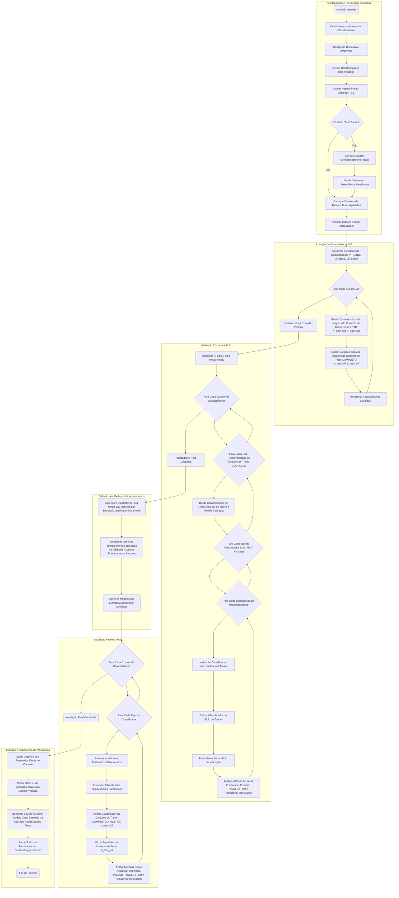

- Subdividir o conjunto de treino original subconjuntos de treino e validação, usando kfold com k = 5. Desse modo, é possível obter 5 medidas de desempenho (uma por validação) para cada configuração (método alternativo) avaliada. 
Obs.: Cada método alternativo será composto de um extrator de características + um classificador + um hiperparâmetro para o classificador. 

- Como extrator de características, avaliar o CLS Token de diferentes modelos ViT disponíveis no HugginFace

- Como classificador, avaliar SVM linear, MLP, Random Forest e KNN. 

- Cada classificador deve ser avaliado com 5 hiperparâmetros distintos (por exemplo, KNN com K = 1, 3, 5, 7 e 9). 

- Selecionar a configuração ideal com base nos resultados de validação. 

- [ ] explicar fcnn
- [ ] reprodizir fcnn
- [ ] fine tuning ??
- [ ] https://huggingface.co/docs/transformers/model_doc/mobilevit