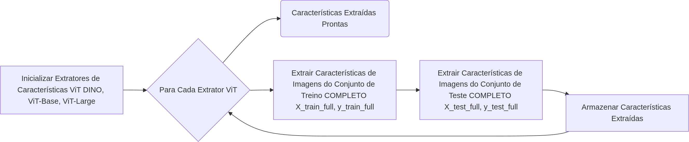
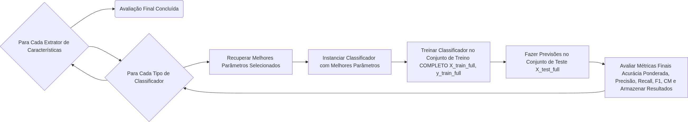
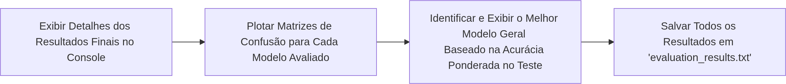

# Vision Transformers para a Classificação de Cianobactérias

---

## Visão Geral

*   **O que o Script Propõe?**
    1.  **Extrair Características:** Obter representações ricas e de alta dimensão de imagens usando modelos ViT (DINO, ViT-Base, ViT-Large).
    2.  **Treinar e Avaliar:** Utilizar classificadores de Machine Learning (SVC, MLP, RandomForest, KNN) sobre essas características extraídas.
    3.  **Otimização de Hiperparâmetros:** Encontrar as melhores configurações para cada classificador através de Validação Cruzada K-Fold.
    4.  **Avaliação Final:** Medir o desempenho dos modelos otimizados em um conjunto de teste independente.
    5.  **Relatório Completo:** Exibir e salvar todos os resultados, incluindo métricas detalhadas e matrizes de confusão.

---
## Fluxo do Pipeline

<!-- 

 

-->

---

## Etapa 1: Configuração Inicial e Preparação de Dados

*   **Bibliotecas Essenciais:**
    `PyTorch`, `Scikit-learn`, `Hugging Face Transformers`, `Matplotlib` e `Seaborn`.

*   **Configuração de Hardware:**
    *   Detecção automática de `GPU (CUDA)` para processamento acelerado, com fallback para `CPU`.
*   **Definição de Hiperparâmetros:**
    *   Conjuntos de hiperparâmetros pré-definidos para cada classificador (e.g., `C` para SVC, `hidden_layer_sizes` para MLP).
*   **Transformações de Imagens:**
    *   `Redimensionamento (224x224)`: Padrão para muitos modelos de visão.
    *   `Conversão para Tensor`: Imagens prontas para PyTorch.
    *   `Normalização`: Ajuste de valores de pixel para melhor desempenho do modelo.

---

## Etapa 2: Carregamento e Divisão do Dataset

*   **Download Dinâmico:**
    *   O script clona o repositório `CTCB` do GitHub, contendo as imagens.
*   **Flexibilidade na Divisão:**
    *   **Cenário 1: Diretórios `Train` e `Test` Separados:** O script carrega diretamente.
    *   **Cenário 2: Apenas Diretório `Train` (mais comum):**
        *   O dataset completo é carregado.
        *   É feita uma divisão `train_test_split` (80% treino, 20% teste).
        *   **Divisão Estratificada:** Essencial para garantir que a proporção de classes seja mantida nos conjuntos de treino e teste, prevenindo desbalanceamento.
*   **`DataLoaders`:**
    *   Criados para gerenciar o carregamento de dados em lotes (batch processing) para a extração de características.

---

## Etapa 3: Extração de Características com Vision Transformers (ViT)

*   **A Classe `FeatureExtractor`:**
    *   **Propósito:** Carregar um modelo ViT pré-treinado e utilizá-lo para converter imagens em vetores numéricos de alta dimensão (características).
    *   **Modelos Utilizados:**
        *   `facebook/dino-vitb8` (DINO)
        *   `google/vit-base-patch16-224` (ViT-Base)
        *   `google/vit-large-patch16-224` (ViT-Large)
    *   **Modo de Avaliação (`.eval()`):** Garante que o modelo se comporta corretamente durante a inferência.
*   **Processo de Extração:**
    *   Itera sobre o `dataloader`.
        *   **Captura do CLS Token:** O primeiro token de saída do ViT é utilizado como vetor de características.
        <!-- token [:,0,:] representa uma sumarização da imagem inteira --> 
    *   **Resultados em NumPy**: As características são convertidas para arrays NumPy para uso pelos classificadores de ML.

---

## Etapa 4: Métricas de Avaliação Robusta (`evaluate_metrics`)

*   **Objetivo:** Fornecer uma avaliação abrangente do desempenho do classificador, com atenção especial a datasets desbalanceados.
*   **Métricas Chave:**
    *   **Acurácia Ponderada por Amostra:**
        *   **NOVIDADE:** Calcula pesos para cada amostra com base na frequência inversa da classe (classes minoritárias recebem mais peso).
        *   Isso substitui a acurácia balanceada e dá mais importância ao desempenho em classes com menos amostras.
    *   **Métricas de Média (Macro e Weighted):**
        *   `Precisão`, `Recall`, `F1-Score` (Macro e Weighted): Essenciais para entender o desempenho por classe e o desempenho geral ponderado.
*   **Análise Detalhada:**
    *   **Matriz de Confusão:** Visualiza o desempenho por classe (Verdadeiros Positivos, Falsos Positivos, etc.).
    *   **Métricas por Classe (TP/TN/FP/FN):** Quantifica o desempenho de True Positives, True Negatives, False Positives, False Negatives para cada classe individualmente.

---

## Etapa 5: Validação Cruzada K-Fold no Treino

*   **Extração Única de Características:**
    *   As características de treino e teste são extraídas **uma única vez** para todo o dataset.
    *   Isso economiza tempo e recursos, pois não há necessidade de re-extrair características para cada fold ou iteração de hiperparâmetros.
*   **K-Fold Cross-Validation:**
    *   O conjunto de treino é dividido em `K=5` folds.
    *   Para cada fold:
        *   Um subconjunto é usado para treino e outro para validação.
        *   **Treinamento de Classificadores de ML:** Cada classificador (SVC, MLP, RandomForest, KNN) é treinado com diferentes combinações de hiperparâmetros.
        *   **Avaliação no Fold de Validação:** O desempenho é medido usando a `acurácia ponderada por amostra` e outras métricas.
    *   **Objetivo:** Avaliar a robustez dos hiperparâmetros e selecionar os melhores.

---

## Etapa 6: Análise e Seleção dos Melhores Hiperparâmetros

*   **Agregação de Resultados:**
    *   Os resultados de cada fold são combinados para calcular as médias das métricas para cada combinação de extrator, classificador e hiperparâmetros.
*   **Critério de Seleção:**
    *   A **Acurácia Ponderada por Amostra Média** obtida na validação cruzada K-Fold é o principal critério.
    *   A combinação de hiperparâmetros que resulta na maior acurácia ponderada média para cada par (extrator ViT, classificador ML) é selecionada como a "melhor".
*   **Resultado:**
    *   Identificação dos hiperparâmetros ideais para cada modelo de ML, garantindo a otimização para as características extraídas por cada ViT.

---

## Etapa 7: Avaliação Final no Conjunto de Teste

*   **Treinamento do Modelo Final:**
    *   Para cada combinação de extrator ViT e classificador ML (com os hiperparâmetros otimizados), o modelo final é treinado usando **TODO o conjunto de treino** (`X_train_full`, `y_train_full`).
*   **Avaliação Independente:**
    *   As previsões são feitas no conjunto de teste (`X_test_full`), que é um conjunto de dados **totalmente novo e não visto** durante o treinamento ou otimização de hiperparâmetros.
    *   São calculadas as métricas de avaliação final (Acurácia Ponderada, Precisão, Recall, F1, Matriz de Confusão, TP/TN/FP/FN por classe).
*   **Importância:**
    *   Esta etapa fornece uma estimativa realista do desempenho do modelo em dados do mundo real.

---

## Etapa 8: Exibição e Salvamento dos Resultados

*   **Resultados Detalhados no Console:**
    *   Cada combinação extrator-classificador exibe suas métricas completas no conjunto de teste.
*   **Visualização da Matriz de Confusão:**
    *   Gerada e plotada com `seaborn` para cada modelo, facilitando a análise de erros e acertos por classe.
*   **Identificação do Melhor Modelo Geral:**
    *   O script identifica automaticamente o modelo com a **maior Acurácia Ponderada por Amostra** no conjunto de teste e destaca seus resultados.
*   **Salvar para Análise Futura:**
    *   Todos os resultados (resumo K-Fold, métricas de teste por modelo, melhor modelo geral, matrizes de confusão numéricas) são salvos em um arquivo `evaluation_results.txt`.

<!-- 
    *   adicionar matriz de confusão
    *   resultados
    *   tabela comparativa com kianian
 -->

---

<!-- 
## Vantagens da Nossa Abordagem

*   **Engenharia de Características Automatizada:**
    *   ViTs pré-treinados fornecem representações de imagem de alta qualidade, reduzindo a complexidade do pré-processamento manual.
*   **Otimização Robusta de Hiperparâmetros:**
    *   A validação cruzada K-Fold garante que os classificadores sejam ajustados para o melhor desempenho em dados não vistos.
*   **Avaliação Abrangente e Robusta:**
    *   Uso de múltiplas métricas (especialmente acurácia ponderada e macro/weighted F1-score) para lidar com datasets desbalanceados.
*   **Análise Detalhada:**
    *   Matrizes de confusão e métricas por classe oferecem insights profundos sobre o desempenho do modelo.
*   **Reprodutibilidade:**
    *   O uso de `random_state` e um pipeline bem definido torna os resultados consistentes e reproduzíveis. 
---
-->

## Resultados

| Métrica                 | Melhor Modelo (Kianian)        | Valor do Artigo | Melhor Modelo (ViT)    | Valor do ViT | Vencedor     |
| :---------------------- | :----------------------------- | --------------: | :--------------------- | -----------: | :-----------: |
| Acurácia Ponderada      | MobileNet + FCNN               | **94.79%**      | DINO + KNN             | 91.34%       | Kianian      |
| F1-Score Ponderado      | MobileNet + FCNN               | 94.91%          | DINO + KNN             | **96.89%**   | ViT          |
| Macro Acurácia          | MobileNetV2 + FCNN             | 90.17%          | DINO + KNN             | **91.34%**   | ViT          |
| Macro F1-Score          | MobileNetV2 + FCNN             | 87.64%          | DINO + KNN             | **91.35%**   | ViT          |

