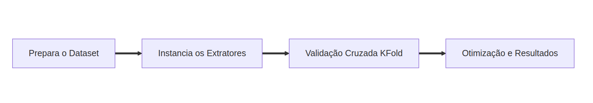
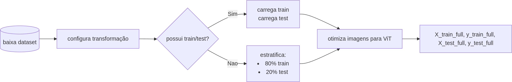
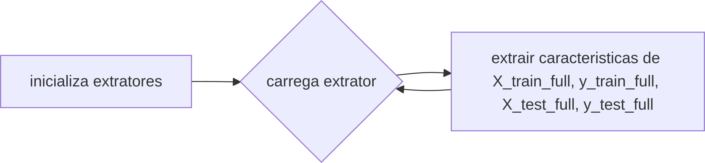
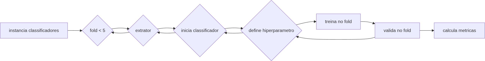
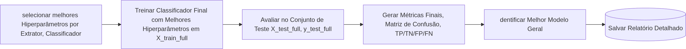

<!-- **Slide 1: Título** -->
# Vision Transformers para a Classificação de Cianobactérias


---

<!-- **Slide 2: Objetivo do Código** -->

## Objetivo Principal

Avaliar e comparar o desempenho de diferentes **classificadores tradicionais** (SVM, MLP, RandomForest, KNN) utilizando **características (features) extraídas por modelos Vision Transformer (ViT)** pré-treinados (DINO, ViT-Base, ViT-Large) em um dataset de imagens.

**Principais Etapas:**
1.  Extração de Features com ViTs.
2.  Validação Cruzada K-Fold para otimizar hiperparâmetros dos classificadores.
3.  Avaliação final no conjunto de teste com os melhores hiperparâmetros.
4.  Geração de relatório detalhado.

---

<!-- **Slide 3: Diagrama de Fluxo do Pipeline** -->

## Visão Geral do Pipeline




---

<!-- **Slide 4: Configuração Inicial** -->

## 1. Preparação do Ambiente

*   **Bibliotecas Essenciais:** `torch`, `torchvision`, `sklearn`, `transformers`, `numpy`, `matplotlib`, `seaborn`.
*   **Dispositivo:** Configura para GPU (CUDA) se disponível, senão CPU.
    ```python
        import torch
        import torchvision.transforms as transforms
        from sklearn.model_selection import KFold
        from transformers import AutoModel

        device = torch.device("cuda" if torch.cuda.is_available() else "cpu")
        print(f"Usando o dispositivo: {device}")
    ```

---

<!-- **Slide 5: Hiperparâmetros e Transformações** -->

## 2. Definindo Parâmetros e Pré-processamento

*   **Hiperparâmetros dos Classificadores:** Grade de busca para otimização.
    ```python
        hyperparameters = {
            "SVC": [{"C": c} for c in [0.1, 1, 10, 100, 1000]],
            "MLPClassifier": [{"hidden_layer_sizes": hls, ...} for hls in ...],
            # ... outros classificadores
        }
    ```
*   **Transformações de Imagem:** Padroniza as imagens para entrada nos ViTs.
    ```python
        transform = transforms.Compose([
            transforms.Resize((224, 224)),
            transforms.ToTensor(),
            transforms.Normalize(mean=[0.5, 0.5, 0.5], std=[0.5, 0.5, 0.5])
        ])
    ```

---

<!-- **Slide 6: Carregamento do Dataset** -->

## 3. Carregamento e Divisão do Dataset

*   Dataset `CTCB` clonado do GitHub.
*   Usa `datasets.ImageFolder`.
*   **Lógica de Divisão:**
    *   Se não houver diretório de Teste, divide o diretório de Treino (80/20 estratificado).
    *   Caso contrário, usa os diretórios de Treino e Teste separados.
        ```python
            # Se não houver Test directory...
            full_dataset = datasets.ImageFolder(root=train_data_dir, transform=transform)
            targets = full_dataset.targets
            train_indices, test_indices = train_test_split(
                list(range(len(full_dataset))),
                test_size=0.2, random_state=42, stratify=targets
            )
            train_dataset = Subset(full_dataset, train_indices)
            test_dataset = Subset(full_dataset, test_indices)
        ```
---

## 3. Carregamento e Divisão do Dataset



---

<!-- **Slide 7: Extrator de Features (ViT)** -->

## 4. Classe `FeatureExtractor`

*   Carrega modelos ViT pré-treinados da Hugging Face (`AutoModel`).
*   Extrai features (geralmente o token `[CLS]`) das imagens.
*   Opera em modo de avaliação (`model.eval()`).

```python
class FeatureExtractor:
    def __init__(self, vit_model_name):
        self.model = AutoModel.from_pretrained(vit_model_name).to(device)
        self.model.eval()

    def extract_features(self, dataloader):
        # ... (loop sobre o dataloader)
        with torch.no_grad():
            outputs = self.model(inputs)
            # Prioriza last_hidden_state[:, 0, :] (CLS token)
            cls_tokens = outputs.last_hidden_state[:, 0, :]
        # ...
        return np.vstack(features), np.hstack(labels)
```
*   **Modelos Usados:** "facebook/dino-vitb8", "google/vit-base-patch16-224", "google/vit-large-patch16-224"

---

<!-- **Slide 8: Função de Avaliação de Métricas** -->

## 5. `evaluate_metrics`

*   Calcula um conjunto abrangente de métricas de classificação.
*   **Métricas Principais:**
    *   Acurácia Ponderada
    *   Precisão, Recall, F1-Score (Macro e Ponderado)
    *   Matriz de Confusão
    *   TP, TN, FP, FN por classe
        ```python
            def evaluate_metrics(y_true, y_pred, class_names=None, num_classes=None):
                acc_weighted_sample = accuracy_score(y_true, y_pred, sample_weight=sample_weights)
                f1_macro = f1_score(y_true, y_pred, average="macro", zero_division=0)
                cm = confusion_matrix(y_true, y_pred, labels=np.arange(num_classes))
                # ... cálculo de TP/TN/FP/FN
                return { "accuracy": acc, "f1_macro": f1_macro, ... }
        ```

---

<!-- **Slide 9: Pipeline Principal - Extração Inicial** -->

## 6. Etapa 1: Extração de Features (Completa)

*   Para cada extrator ViT:
    *   Extrai features de **TODO** o conjunto de treino (`X_train_full`, `y_train_full`).
    *   Extrai features de **TODO** o conjunto de teste (`X_test_full`, `y_test_full`).
*   **Objetivo:** Evitar re-extração custosa dentro do loop K-Fold.

```python
feature_data = {}
for extractor_name, extractor in vit_extractors.items():
    X_train_full, y_train_full = extractor.extract_features(full_train_loader)
    X_test_full, y_test_full = extractor.extract_features(test_loader)
    feature_data[extractor_name] = { 'X_train_full': X_train_full, ... }
```

---
## 6. Etapa 1: Extração de Features (Completa)




---

<!-- **Slide 10: Pipeline Principal - Validação Cruzada K-Fold** -->

## 7. Etapa 2: Validação Cruzada K-Fold (em `X_train_full`)

*   **Objetivo:** Encontrar os melhores hiperparâmetros para cada par (Extrator + Classificador).
*   Usa `KFold` (5 folds) sobre as *features de treino extraídas* (`X_train_full`).
*   Para cada fold, extrator, classificador e conjunto de hiperparâmetros:
    1.  Treina o classificador (`clf.fit(X_train_fold, y_train_fold)`).
    2.  Valida no fold de validação (`clf.predict(X_val_fold)`).
    3.  Armazena métricas.
        ```python
            kfold_results = []
            # Loop sobre extratores
            # Loop sobre folds (kf.split(X_train_full))
                # Loop sobre classificadores (classifiers_map)
                # Loop sobre hiperparâmetros
                    clf = clf_class(**params)
                    clf.fit(X_train_fold, y_train_fold)
                    y_pred_fold = clf.predict(X_val_fold)
                    metrics = evaluate_metrics(y_val_fold, y_pred_fold, ...)
                    kfold_results.append({ ... 'metrics': metrics })
        ```

---

<!-- **Slide 11: Pipeline Principal - Seleção dos Melhores Hiperparâmetros** -->

## 8. Etapa 3: Análise K-Fold e Seleção

*   Agrega as métricas dos folds para cada combinação (Extrator, Classificador, Parâmetros).
*   Calcula a **média da Acurácia Balanceada** (`balanced_accuracy`) através dos folds.
*   Seleciona o conjunto de hiperparâmetros com a maior Acurácia Balanceada média para cada par (Extrator, Classificador).
    ```python
        # aggregated_kfold_metrics[...] -> lista de métricas por fold
        # average_kfold_metrics[...] -> média das métricas

        best_params_per_clf_extractor = {} # Armazena os melhores params
        selection_metric = 'balanced_accuracy'
        # ... Lógica para encontrar o máximo da selection_metric ...
    ```

---

## 8. Etapa 3: Análise K-Fold e Seleção




---

<!-- **Slide 12: Pipeline Principal - Avaliação Final no Teste** -->

## 9. Etapa 4: Avaliação Final no Conjunto de Teste

*   Para cada par (Extrator, Classificador):
    1.  Usa os **melhores hiperparâmetros** encontrados na Etapa 3.
    2.  Treina o classificador com esses parâmetros em **TODO** o `X_train_full`.
        ```python
        clf = clf_class(**best_params)
        clf.fit(X_train_full, y_train_full)
        ```
    3.  Avalia o desempenho no `X_test_full`.
        ```python
        y_pred_test = clf.predict(X_test_full)
        test_metrics = evaluate_metrics(y_test_full, y_pred_test, ...)
        ```
    4.  Armazena os resultados finais.

---

<!-- **Slide 13: Resultados e Análise** -->

## 10. Exibição e Salvamento dos Resultados

*   **Para cada modelo final testado:**
    *   Imprime métricas detalhadas (Acurácia, Precisão, Recall, F1, etc.).
    *   Plota a **Matriz de Confusão** usando `seaborn.heatmap`.
        ```python
                sns.heatmap(cm_np, annot=True, fmt='d', cmap='Blues', ...)
                plt.show()
        ```
    *   Lista TP, TN, FP, FN por classe.
*   **Identifica o "Melhor Modelo Geral"** baseado na maior Acurácia Balanceada no conjunto de teste.
*   **Salva todos os resultados** (K-Fold, Teste Final, Melhor Geral) em um arquivo de texto (`evaluation_results.txt`).

---
## 10. Exibição e Salvamento dos Resultados


---

<!-- **Slide 14: Conclusão** -->

## 10. Exibição e Salvamento dos Resultados

```bash
    Overall Best Model configuration based on Test Set Sample-Weighted Accuracy (0.9134):
    ------------------------------------------------------------
    Extractor: DINO
    Classifier: KNN
    Parameters (Selected by K-Fold): {'n_neighbors': 1}
    ------------------------------------------------------------
    Metrics on Test Set for the Best Model:
    Accuracy (Sample Weighted): 0.9134
    Precision (macro): 0.9316
    Recall (macro): 0.9134
    F1-Score (macro): 0.9135
    Precision (weighted): 0.9704
    Recall (weighted): 0.9691
    F1-Score (weighted): 0.9689
```
---
## 10. Exibição e Salvamento dos Resultados

| Métrica                 | Melhor Modelo (Kianian)        | Valor do Artigo | Melhor Modelo (ViT)    | Valor do ViT | Vencedor     |
| :---------------------- | :----------------------------- | --------------: | :--------------------- | -----------: | :-----------: |
| Acurácia Ponderada      | MobileNet + FCNN               | **94.79%**      | DINO + KNN             | 91.34%       | Kianian      |
| F1-Score Ponderado      | MobileNet + FCNN               | 94.91%          | DINO + KNN             | **96.89%**   | ViT          |
| Macro Acurácia          | MobileNetV2 + FCNN             | 90.17%          | DINO + KNN             | **91.34%**   | ViT          |
| Macro F1-Score          | MobileNetV2 + FCNN             | 87.64%          | DINO + KNN             | **91.35%**   | ViT          |


<!-- Melhor Resultado Ponderado (Weighted):
●​ Extrator: MobileNet (fine-tuned)
●​ Classificador: FCNN
●​ Métricas:
●​ Acurácia Ponderada: 94.79%
●​ F1-Score Ponderado: 94.91%
2.​ Melhor Resultado Macro:
●​ Extrator: MobileNetV2 (fine-tuned)
●​ Classificador: FCNN
●​ Métricas:
●​ Recall Macro: 90.17%
●​ F1-Score Macro: 87.64% -->